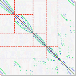

# Sparse_Matrix_Computations  - CSCI 8314 - F26 

    
  <em>  ==== csci 8314 sparse matrix computations ==== 
  </em>

~~~
Welcome to the csci 8314 repository. 

~~~

## Course Syllabus
* [Download Syllabus](syllabus.pdf)

## Schedule

First lecture: Sept. 9th. Last: Dec. 16th.
Projects due last day of class.

 <b>Detailed schedule</b> (tentative) 

  
| Quiz 1 | Quiz 2 | Quiz 3 | Quiz 4 | Presentations |
| -------- | -------- |-------- |-------- |-------- |
| Sep 23   |  Oct  7  |  Oct 28  |  Nov 11 |  Dec 14 & 16  |

# Lectures
  
* [Go to Lecture Notes](Notes.md)  
